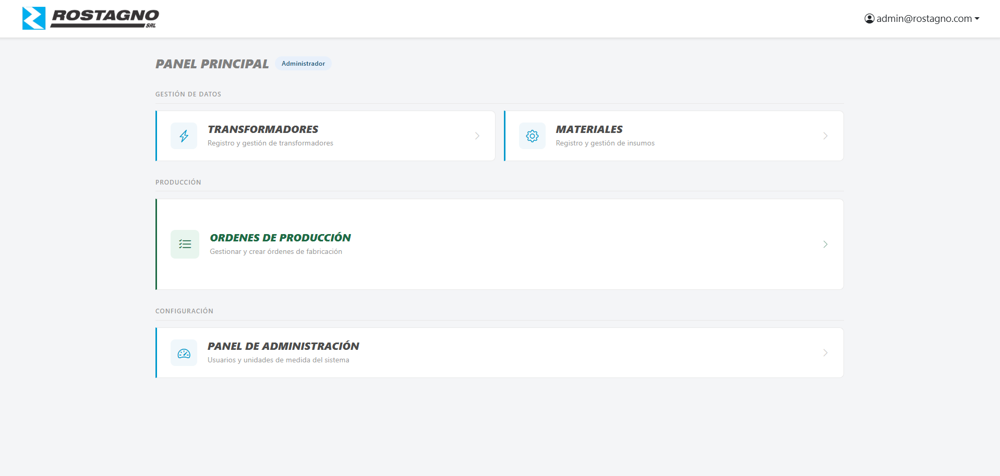
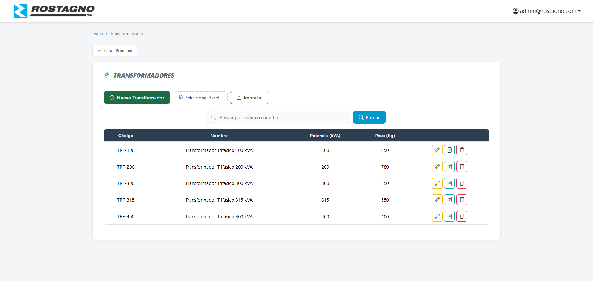
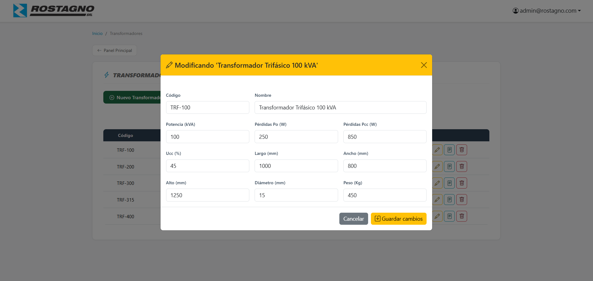
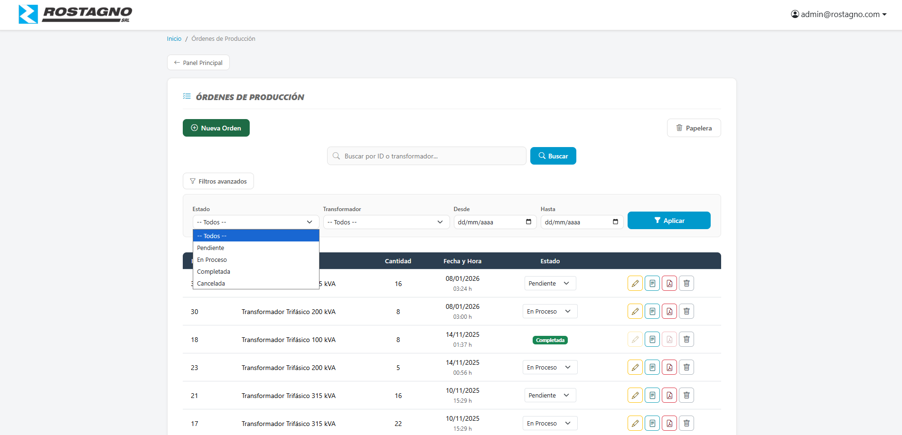
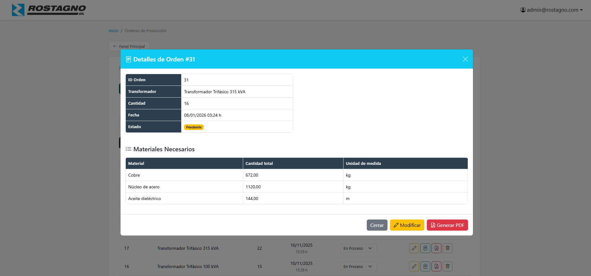
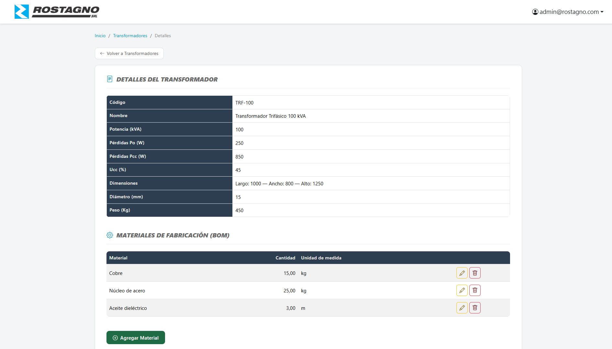

# Sistema de Gestión Rostagno SRL

Sistema web de gestión interna para una empresa fabricante de transformadores eléctricos. Permite administrar productos, materiales, estructuras de producto (BOM) y órdenes de producción, con control de acceso por roles.

Desarrollado por **Gastón Galotto**

---

## Capturas de pantalla

### Dashboard — Administrador


### Transformadores — Listado


### Modal de edición


### Órdenes de Producción


### Filtros avanzados


### Detalle de Transformador con BOM


---

## Tecnologías utilizadas

| Capa | Tecnología |
|---|---|
| Backend | ASP.NET Core MVC 8, C# |
| ORM | Entity Framework Core + LINQ |
| Base de datos | SQL Server LocalDB |
| Frontend | Razor Views, Bootstrap 5, Bootstrap Icons |
| Autenticación | ASP.NET Core Identity + Roles |
| Librerías | ClosedXML, iTextSharp.LGPLv2.Core |

---

## Funcionalidades principales

### 🔐 Roles de usuario
- **Administrador** — acceso completo a todos los módulos
- **Operario** — acceso restringido al módulo de Órdenes de Producción

### 📦 Transformadores (Productos)
- CRUD completo con modales
- Importación masiva desde archivos Excel
- Vista de detalle con BOM (lista de materiales) asociada
- Búsqueda por código o nombre con paginación

### 🔩 Materiales
- CRUD completo con modales
- Importación masiva desde Excel
- Asociación con unidades de medida

### 📋 BOM — Estructura de producto
- Asociación de materiales a transformadores con cantidad requerida

### 🏭 Órdenes de Producción
- CRUD completo con modales
- Flujo de estados: `Pendiente → En Proceso → Completada / Cancelada`
- Cambio de estado con confirmación por modal
- Papelera con restauración o eliminación definitiva
- Filtros avanzados por estado, producto y rango de fechas
- Exportación individual a PDF
- Preview de BOM al crear o editar una orden

### ⚙️ Panel de Administración
- Gestión de usuarios y asignación de roles
- Administración de unidades de medida

---

## Requisitos previos

- [.NET 8 SDK](https://dotnet.microsoft.com/en-us/download/dotnet/8)
- SQL Server LocalDB (incluido con Visual Studio)
- Visual Studio 2022 o superior

---

## Instalación y ejecución

```bash
# 1. Clonar el repositorio
git clone https://github.com/gastong99/gestion-rostSRL.git
cd gestion-rostSRL/TransformadoresApp

# 2. Restaurar dependencias
dotnet restore

# 3. Aplicar migraciones (crea la base de datos automáticamente)
dotnet ef database update

# 4. Ejecutar la aplicación
dotnet run
```

La aplicación estará disponible en `https://localhost:5001` (o el puerto configurado).

> **Nota:** Al iniciar por primera vez, el sistema crea automáticamente los roles y el usuario administrador por defecto mediante un seed inicial.

---

## Estructura del proyecto

```
├── Controllers/
├── Models/
├── Views/
│   ├── Home/          # Dashboards por rol
│   ├── Products/      # Transformadores
│   ├── Materials/
│   ├── BomItems/
│   ├── ProductionOrders/
│   ├── Admin/
│   ├── UnitOfMeasures/
│   └── Shared/        # Layout, breadcrumbs, modales compartidos
├── Forms/             # Formularios parciales (Create/Edit por módulo)
├── docs/
│   └── screenshots/   # Capturas de pantalla
├── wwwroot/
│   ├── css/site.css
│   └── js/            # Scripts de modales por módulo
└── appsettings.json
```
